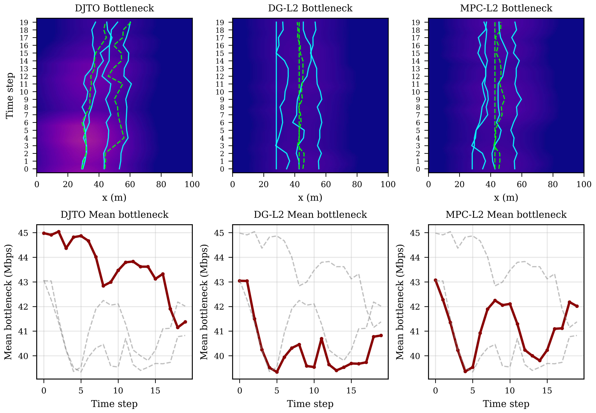

# A_Differentiable_Joint_Trajectory_Approach
This paper formulates this problem as maximizing the worst-user cumulative throughput over a time horizon,and introduces Differentiable Joint Trajectory Optimization,a fully differentiable framework that replaces hard max-min operations with smooth approximations, enabling gradient-based joint optimization of all UAV positions across time slots. 

